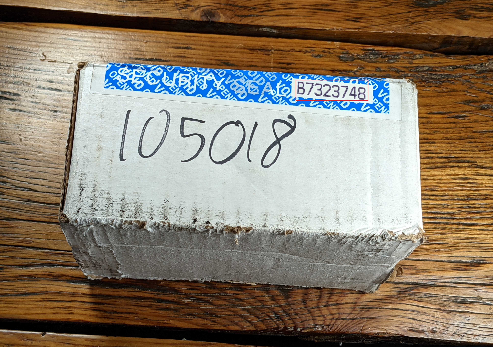
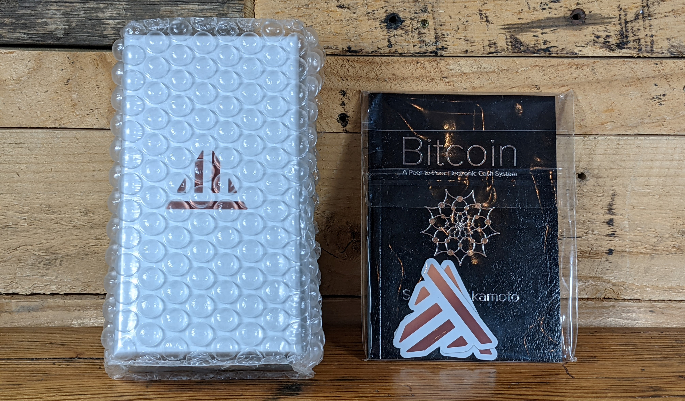
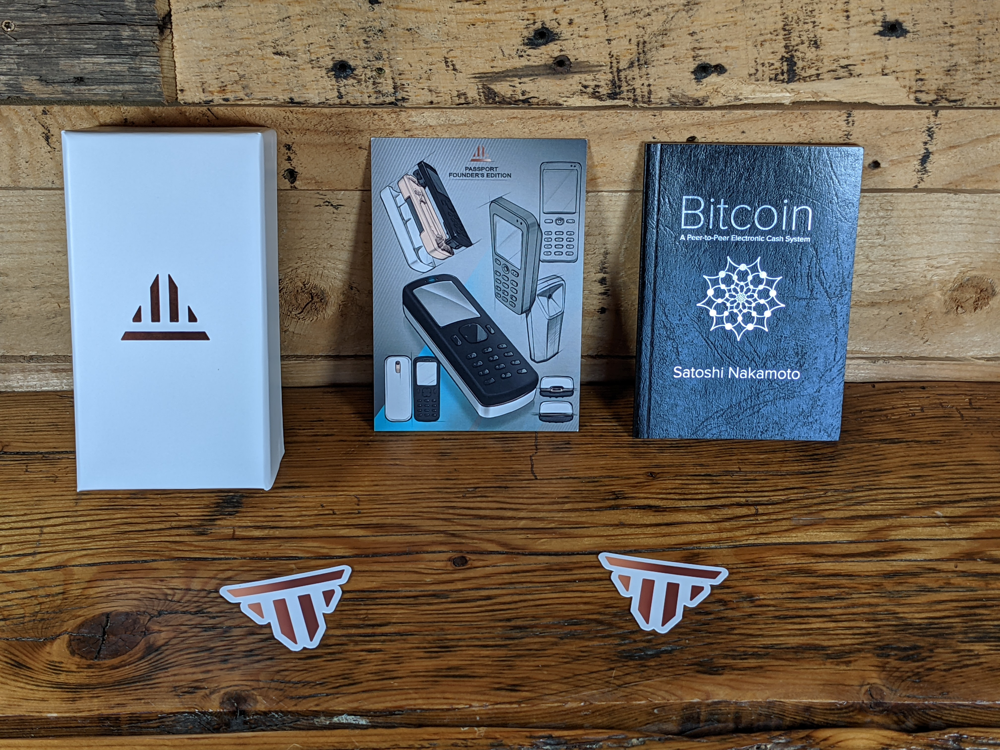
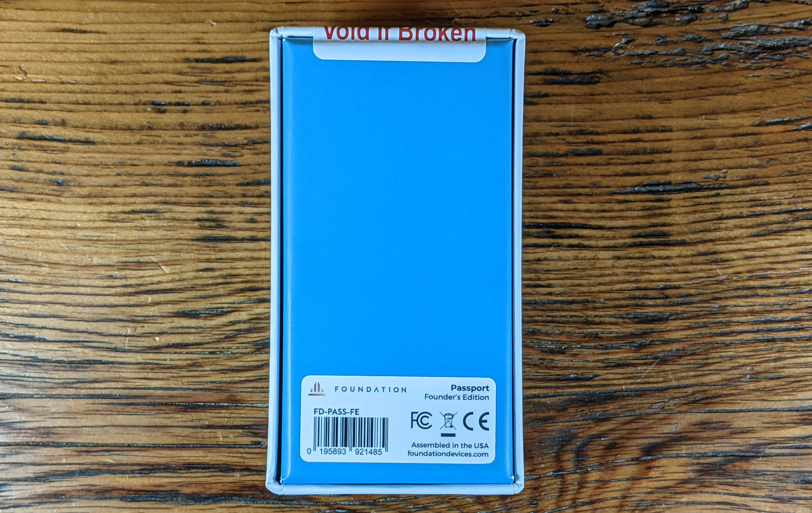
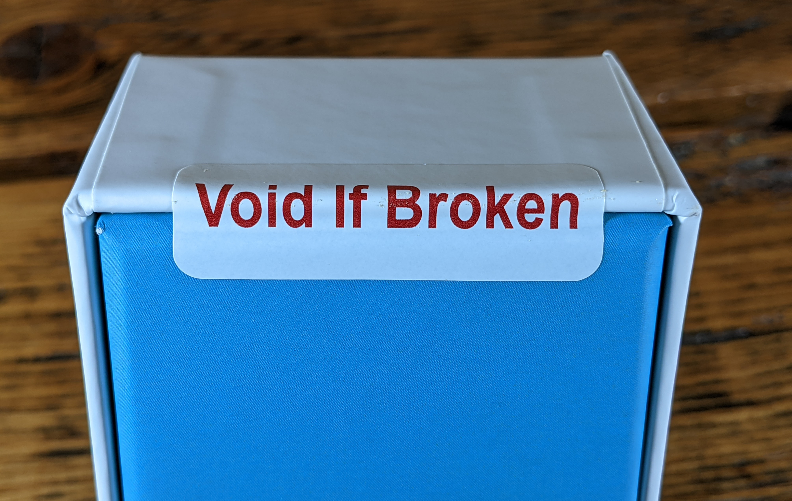
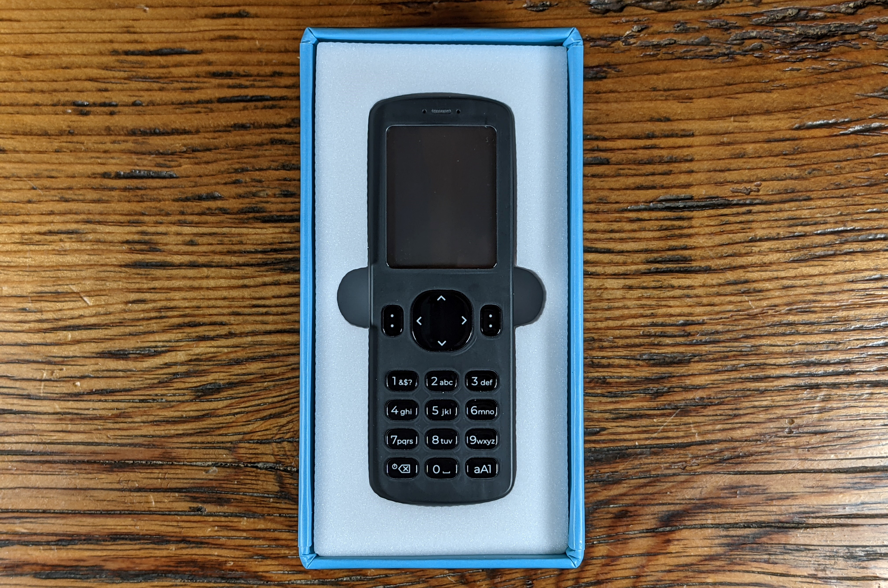
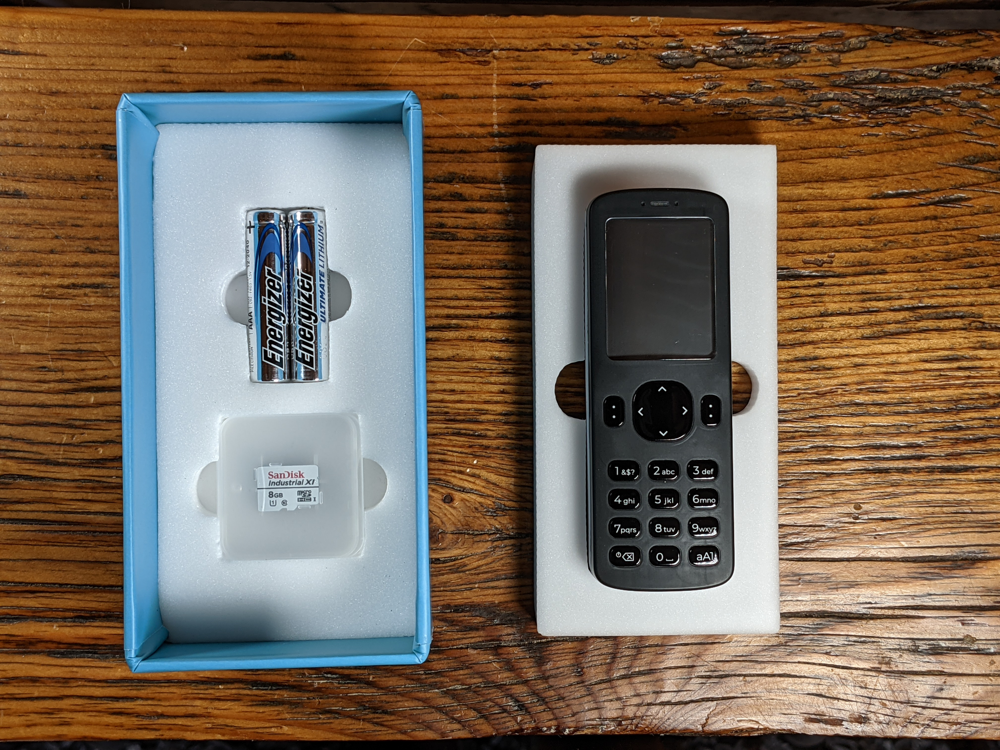
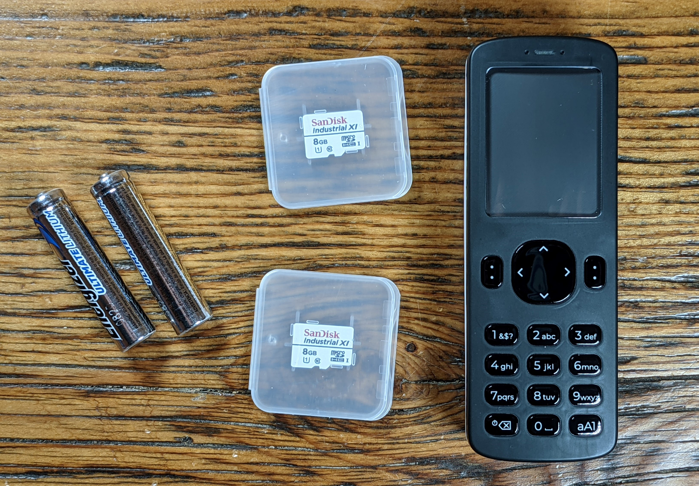
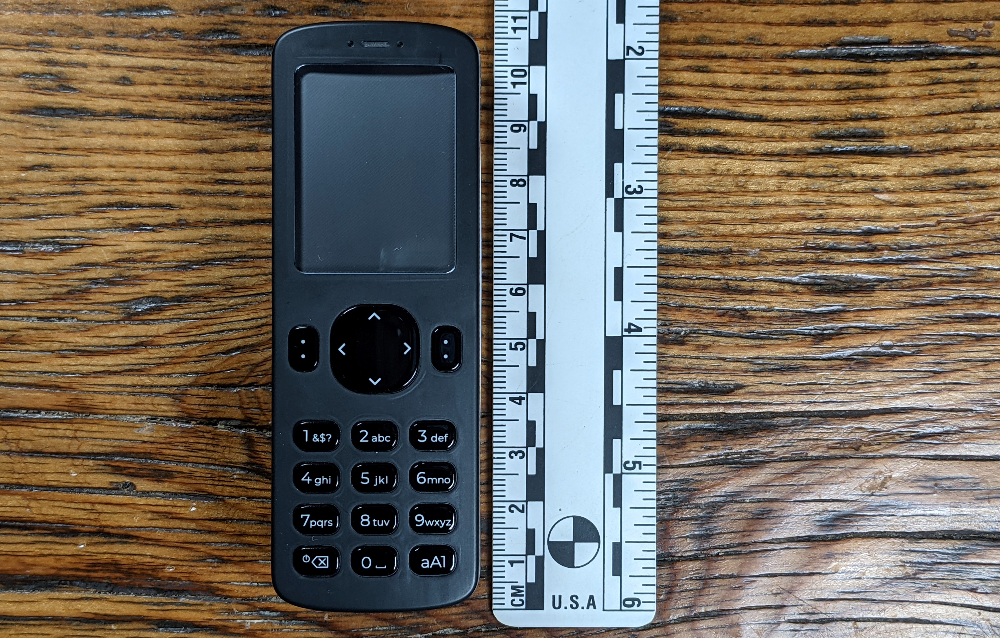
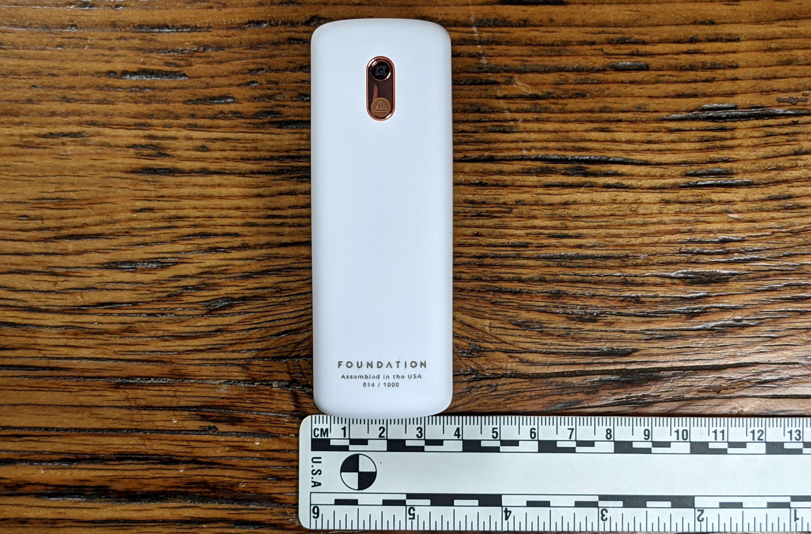

## Unboxing

Generally speaking, it is good practice to use a P.O. Box when ordering Bitcoin related products or materials. This helps prevent your exposure to risks associated with data breaches. If you have any suspicoin that your device was tampered with in transit, contact [hello@foundationdevices.com](mailto:hello@foundationdevices.com).  

The Passport is shipped in a white cardboard box with a blue tamper-evident security seal. There is nothing on the outside of the box which indicates it has anything to do with Bitcoin. The number printed on the security seal will be used later to verify the device you received was the same one packaged at the factory, so note this number or don't discard it until you have completed that step. If the tamper-evident tape is disturbed, it will reveal the word "VOID".  

  
  

Inside the cardboard box you will find a bubble-wrapped box containing the Passport. This inner box also has a tamper-evident seal on it. You will also find some stickers and a notecard with some basic explainations on it about your new Passport. The founders addition includes a miniture copy of the Bitcoin white paper printed in the form of a passport. 

  
  

  
  

After removing the bubble wrap and cutting the tamper-evident seal, inside the inner box you will find your new Passport. Underneath the Passport you will find two AAA batteries and two 8GB microSD cards. 

  
  

All together, everything necessary to get started is included. The Passport measures 108mm in length by 38mm in width. 

  

