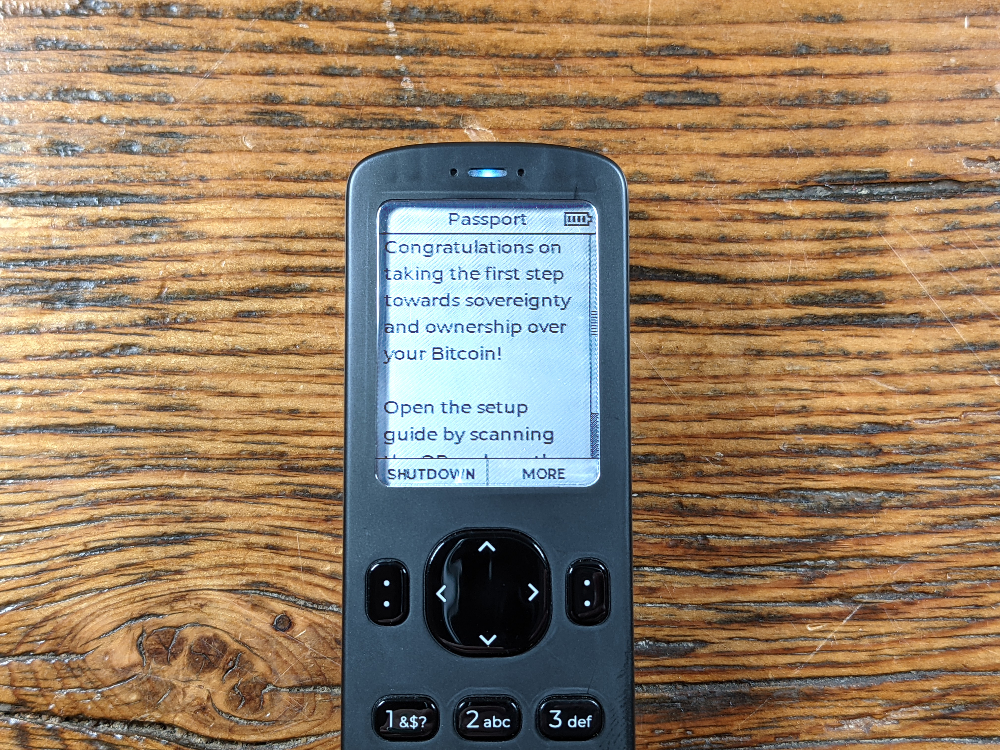
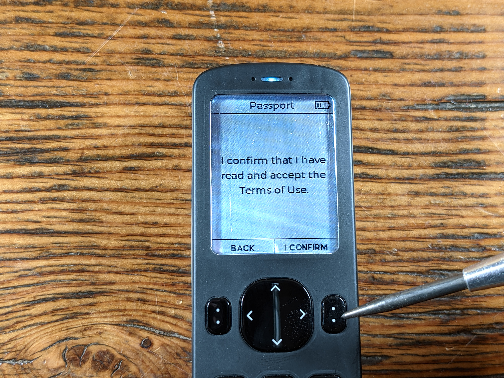
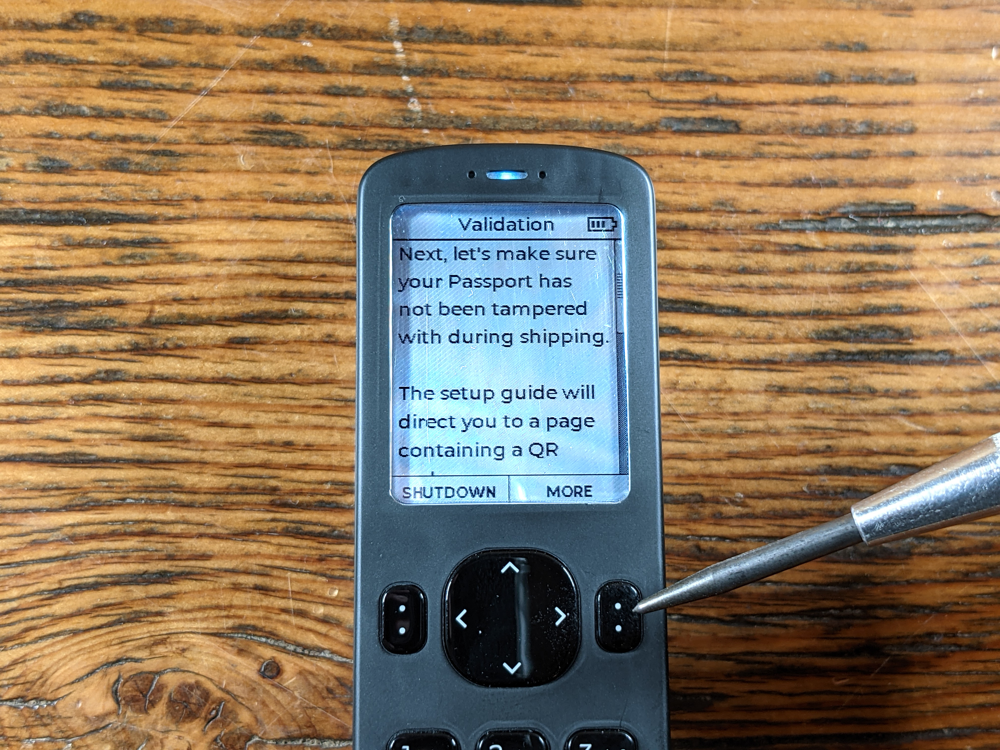
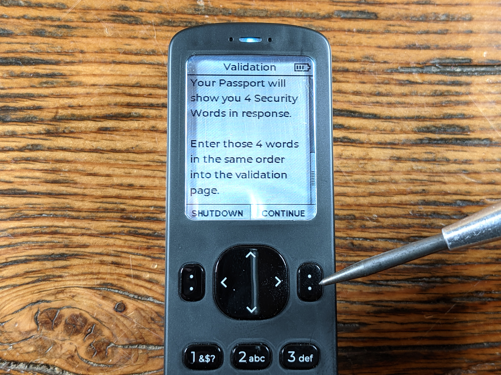
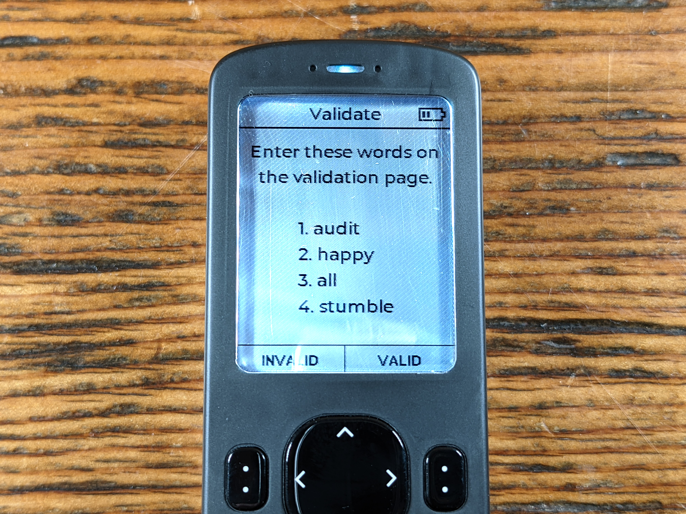

# Supply chain Validation
This section demonstrates how to power on the Passport and execute the supply chain validation. There is a private key stored on the secure element used for this validation. By scanning a static public key QR code with the Passport, it will generate 4-words which are used as a checksum that only a valid Passport private key can produce. 

Hold down the button in the lower left-hand corner of the Passport for about half a second until the device lights up. After initial boot, you will be greeted with a welcome message. You can scroll to the bottom of that message by holding the <kbd>down arrow</kbd> then press the <kbd>continue</kbd> button.

  

  
- Next, you will see a QR code that you can scan with your phone to visit the [Setup Guide](https://docs.foundationdevices.com/setup-guide) if you haven't done so already. 
- Then you will need to accept the [Terms of Use](https://foundationdevices.com/passport-terms/) by pressing the <kbd>continue</kbd> button.
- Finally, confirm having read the terms by pressing the <kbd>continue</kbd> button. 

  

For this next step, ensure your batteries are well charged, then you will want to have the [Supply Chain Validation](https://validate.foundationdevices.com/) QR code open on your computer or phone. Read and scroll down to the end of the Validation message, then press the <kbd>continue</kbd> button. This will launch the camera and you can then scan the validation QR code on your device's screen. 

  

  
The Passport will then display 4-words on the screen. Enter these words into the interface under the validation QR code. You should receive a validation message confirming that your device is a legit Foundation device.    

  

Then press the <kbd>VALID</kbd> button and you are ready to set up your PIN. At this point, it is a good idea to get a notepad and pen or pencil ready to write down some information that you will need to secure.   
