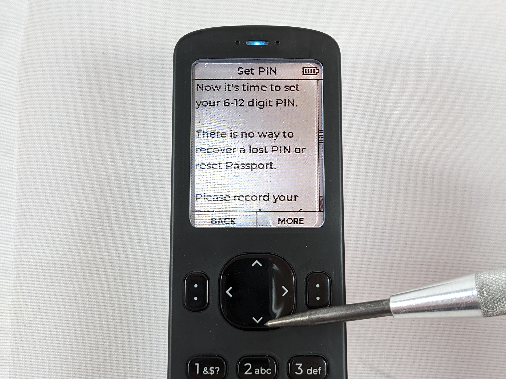
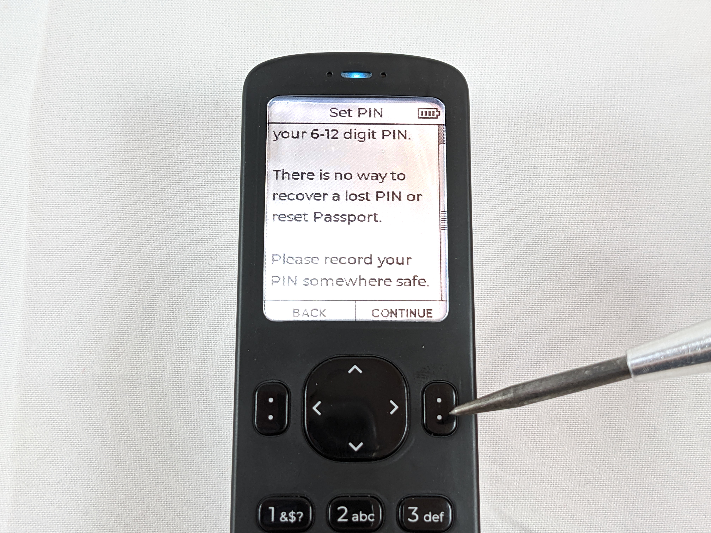
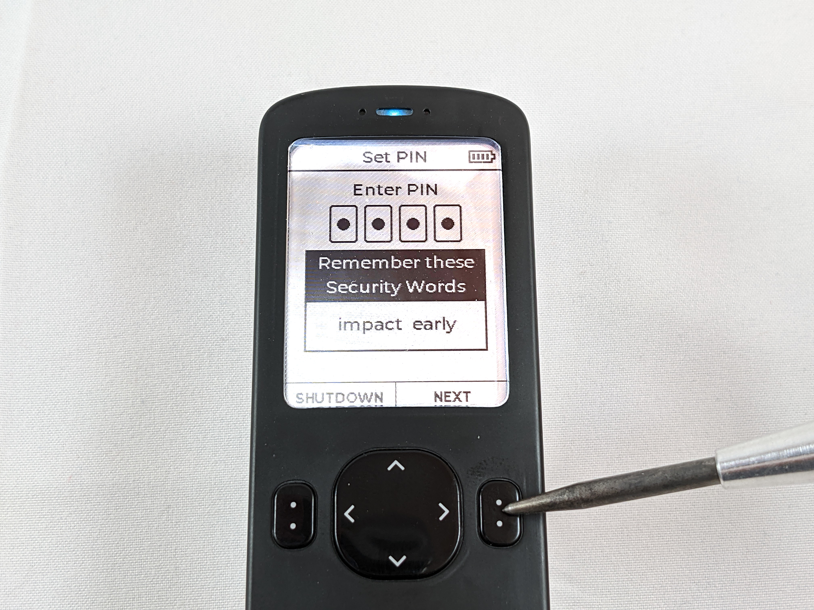
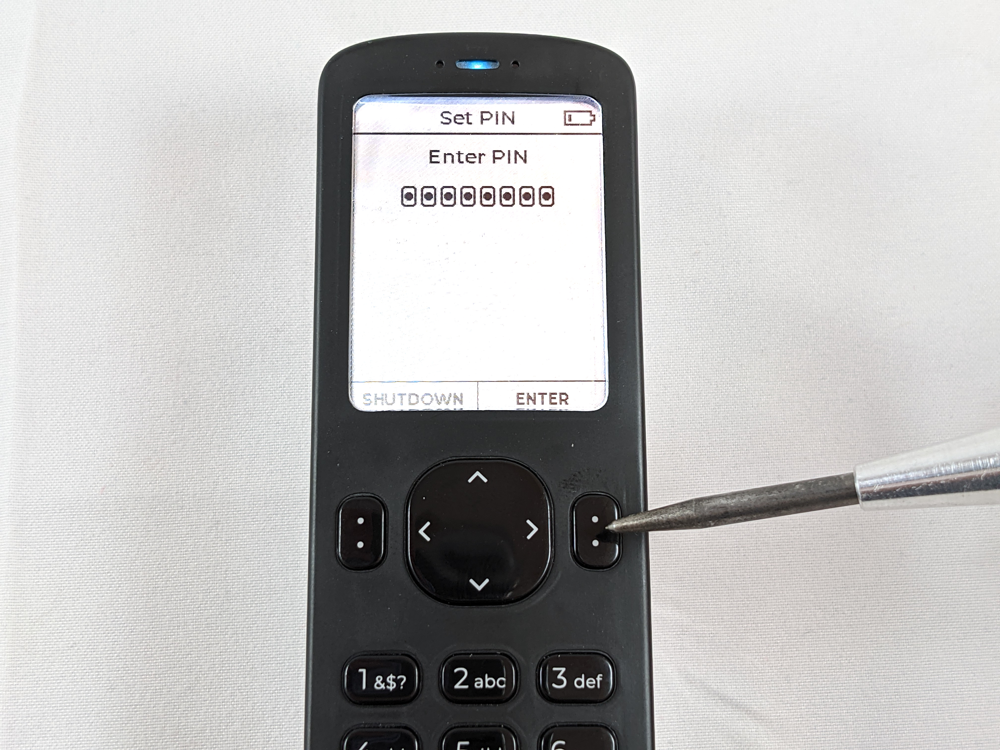
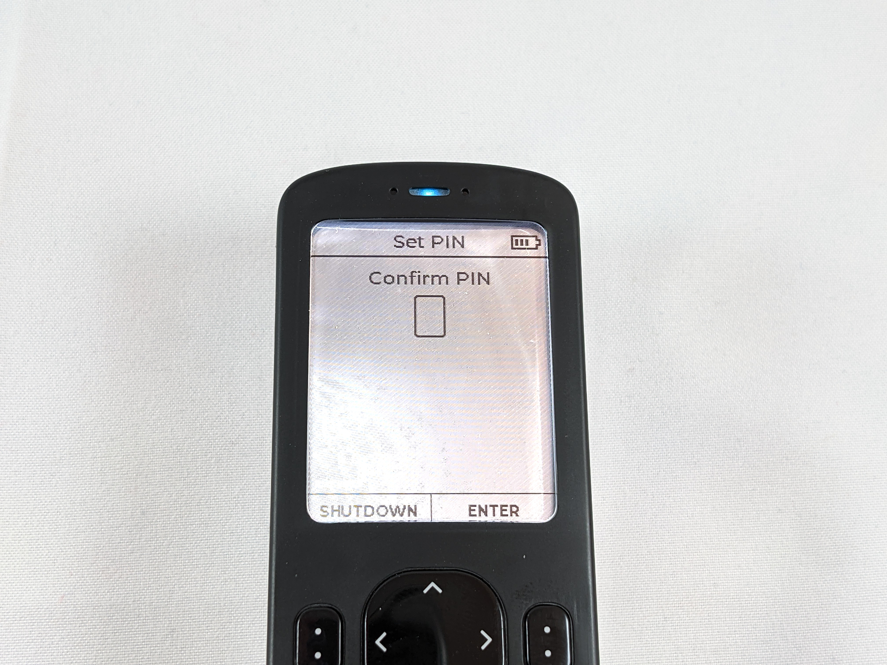
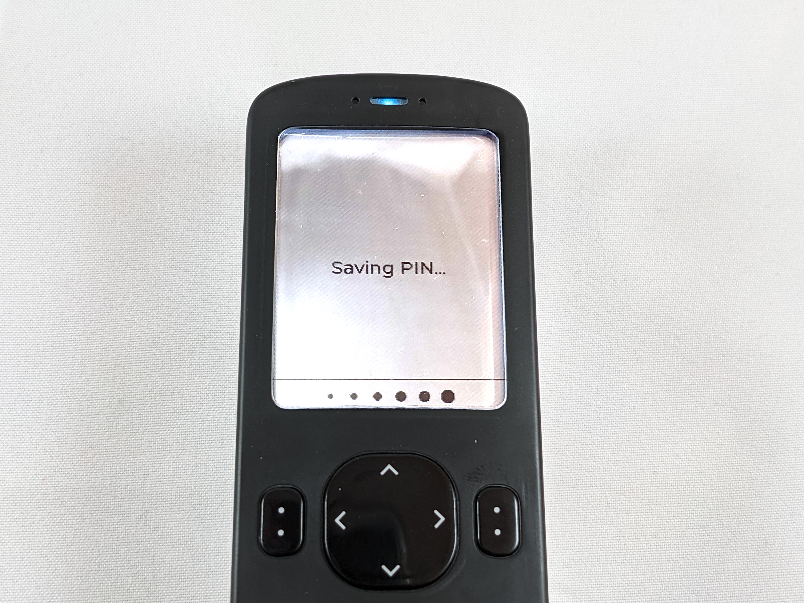

# PIN Setup
This section demonstrates how to setup the PIN for accessing your Passport. Have a notebook and pen or pencil ready. To start, there are a few considerations to understand and then the steps to complete this process are outlined.  

The PIN number is used to secure access to your Passport. Without the PIN number, your Passport will be inaccessible. There is no way to recover a lost or forgotten PIN, so be sure to secure your PIN in such a way that you will not lose access to it. Best practice is to physically write this information down in a notebook that you keep private and secure. Throughout this guide, there are going to be a few pieces of information that will be sensitive in regards to accessing the Passport and the signing keys it will contain. By writing this information down on paper, you can mitigate the risks introduced using digital media. For example, in a digital file, this information can be remotely accessed on a network connected computer if the computer is compromised. Additionally, other forms of digital media such as images or video can not only be accessed remotely on a compromised device but they could also be copied and transferred quickly and easily by anyone who has physical access to the computer or other device. Although it is true that anyone with physical access to the hand-written information could easily snap a picture of it, at least the notebook could be easily hidden in an inconspicuous place or secured in a safe whereas putting a computer in a safe may not be convineient or practical.   

Using a PIN that is easy to guess could result in loss of bitcoin if an adversary gets ahold of your Passport. There is benefit to using a PIN that is difficult to guess. The PIN must be at least 6-digits in length. You will enter the first 4-digits and then you will be presented with two anti-phishing words. Write down these anti-phishing words, these are unique words that are generated by using some entropy from the Passport in combination with your PIN's first 4-digits. After establishing your new PIN, upon re-entry to the Passport, you will be presented with these same two anti-phishing words. If you are ever presented with different ant-phishing words then you either entered the first 4-digits of your PIN incorrectly or your device has been tampered with. If that happens to you, do not proceed with accessingyour device until you figure out which situation you are in at that point.

As a security feature, the Passport will brick itself if there are 21 failed PIN attempts. Once a valid PIN is entered, the counter resets to 0. 

After the supply chain validation from the last section, you should see a message on your Passport that explains some details about the PIN. Scroll down to the bottom of that message with the <kbd>down arrow</kbd>. After reading the entire message, press the <kbd>continue</kbd> button. 

  

  
Next, you will be presented with a blank PIN entry dialog. Use the numbered keys on the Passport to enter the first 4-digits of your new PIN. Immediatly upon entry of the 4th digit, you will be presented with the two anti-phishing words. Write down the first 4-digits of your PIN along with these two anti-phishing words. Speaking this information outloud could introduce a potential risk of exposing the details to any devices that may be listening to you. Then press the <kbd>next</kbd> button and enter the remaining part of your PIN and write that down too. This remaining part needs to be at least 2-digits long and can be as much as 8-digits in length. Your PIN in its entirety can be up to 12-digits in length. In this example, the PIN `12345678` is used. Do not use `12345678` for your PIN.      
  
  

  

  
When finished press <kbd>enter</kbd>. You will then be asked to confirm your PIN by first re-entering the first 4-digits, confirming the two anti-phishing words, and re-entering the remaining part of the PIN.

 

  

  
Again, press <kbd>enter</kbd> when finished and the Passport will save this information. From now on the PIN will be required to access your Passport. A lost or forgotten PIN cannot be retrieved from the Passport. No one can assist you with recovering a lost or forgotten PIN. The Passport will brick itself after 21 failed PIN entries. Be sure to write down and secure your entire PIN and the two anti-phishing words. Once the Passport is finished saving the PIN details, you will be at the main menu. 

  

Before setting up your new cold storage wallet, it is a good idea to ensure the firmware is up to date. 
