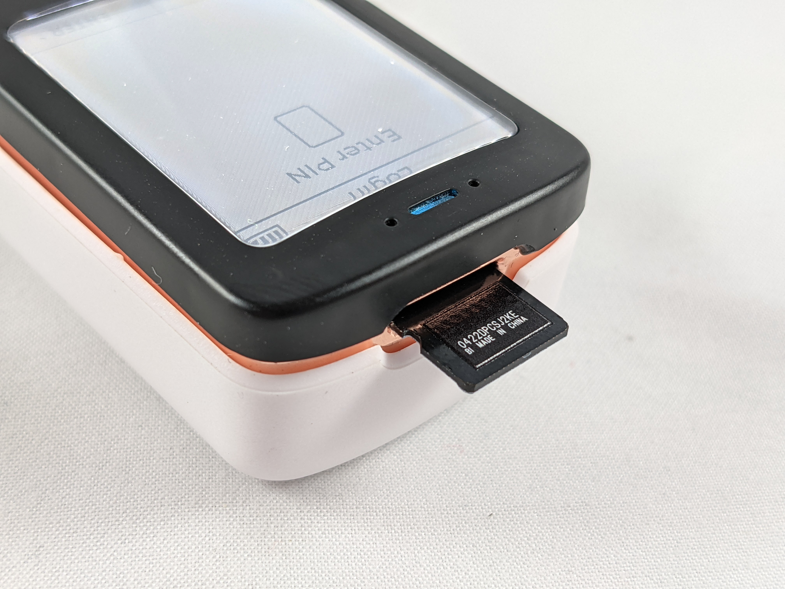

# Firmware Update

For this section you will need an USB adaptor and your included microSD card. Keeping the firmware on the Passport is important as this is how new features are introduced, quality of life improvements are made, security issues are resolved, and bugs are fixed. Foundation regularly releases firmware updates so be sure to stay up to date with these as they occur. Navigate to the official [Foundation firmware page](https://docs.foundationdevices.com/en/firmware-update) to see more details. 

In this section updating the firmware will be demonstrated in two ways. The first way involves fewer steps but foregoes independent verification, the second way demonstrates using the developer's PGP public keys and signatures to cryptographically verify the integrity of the firmware file. 

The Passport will only allow firmware to be installed if it has been signed by at least two out of four possible Foundation developer PGP keys. This gives beginner or intermediate users the ability to update their firmware with a reasonable degree of confidence, while giving advanced users the ability to verify the integrity of the firmware themselves. 

Before getting started with either approach outlined below, first check your Passport to compare the currently installed firmware version with the currently available firmware version. 

Log into your Passport by powering it on, typing in the first 4-digits of your PIN, confirming your two anti-phishing words, and entering the remainder of your PIN. From the main menu, navigate to `Settings > Firmware > Current Version`.

 

  

There you will see the currently installed firmware version, the date of its release, and a boot counter. The boot counter tells you how many times the Passport has been powered on. Compare the currently installed firmware version to the displayed currently available version on the Foundation [firmware download page](https://docs.foundationdevices.com/en/firmware-update). If the installed version is lower than the available version, then you will want to update that. If you have the latest firmware installed then you can skip to the next section. Press the <kbd>back</kbd> button to return to the previous sub menu. 

 

  

## Simple Firmware Update
Navigate to the Foundation [Setup page](https://docs.foundationdevices.com/en/setup-guide) and click on the link to open the [firmware download](https://github.com/Foundation-Devices/passport-firmware/releases/download/v1.0.8/passport-fw-1.0.8.bin)

 

  

Clicking on that link will automatically initiate the Foundation firmware `.bin` file download to your computer. If your computer is equipped with a microSD slot, then you can simply insert the microSD card. If your computer does not have a microSD slot then you may need to use your own USB-to-microSD adaptor, insert your included microSD card into the USB adaptor and then insert that adaptor into a USB port on your computer. Once the computer recognizes your USB adaptor then simply open a file explorer and copy/paste the firmware `.bin` file to the microSD card. Then safely eject the microSD card.  

 

  
  
  

The microSD card inserts to the port on the top of the Passport. The microSD card does not fully insert to the device, it will be sticking out about half way. Ensure the pins on the microSD card are facing up, the same direction as the face of the device. 

 

  
  
  

- From the same sub-menu where you checked the firmware version, select `Update Firmware` this time. 
- Then follow the prompt and press <kbd>continue</kbd>. 
- On the next screen scroll to the bottom of the message by pressing the <kbd>down arrow</kbd>. 
- Confirm you want to proceed by pressing <kbd>yes</kbd>. 

 

  

On the next screen you will see a message warning you not to power off the Passport during the firmware update. Having fresh batteries installed is recommended. Press <kbd>OK</kbd> to continue. Then the passport will first prepare the update and then execute the update. After a moment the Passport will display the new currently installed firmware version. 

 

  

After the firmware update is finished you can remove the microSD card and continue to setup your seed phrase. Or if you want to see how to cryptographically verify the integrity of the firmware file before you install it on your Passport, then continue with the advanced update details below.

## Advanced Firmware Update
Learning how to verify software is an important but often overlooked step that can save you from a number of threats. The risk is that malicious software could be uploaded to compromised servers that you then download thinking it is legitimate. Or malicious websites that aim to imitate the legitimate website could fool you into thinking you are getting the software from the real company directly. 

The basic idea behind software verification is that you can use cryptographic signatures and hash values to prove that the software you downloaded is in fact exactly what the developers intended on you receiving. This is different than a security audit, in which experts parse through the code line by line to verify that it is not doing anything malicious. The verification part only assures that the downloaded software is what it purports to be, whether or not the developers who created that software are up to nafarious schemes is another issue but one that is mitigated through open source software that anyone can look into and put many eyes on. 

There are a couple things you will need in order to verify your Passport firmware:
- Key manager;  Gpg4win for [Windows](https://www.gpg4win.org/), GPGTools for [Mac](https://gpgtools.org/), or GnuPG which already comes pre-installed on [Linux](https://www.gnupg.org/download/).
- The [Foundation public key](https://docs.foundationdevices.com/foundation_key.pgp).
- The latest Passport firmware file, signature file, & hash value which can all be found on [the Foundation GitHub repository here](https://github.com/Foundation-Devices/passport-firmware/releases).

The steps outlined below will be demonstrated with the Windows Gpg4win key manager tool. If you are using Linux, the instructions can be found [on the official Foundation page here](https://docs.foundationdevices.com/en/firmware-update).

You will need to have your own PGP key pair setup in Kleopatra (the key manager tool in Gpg4win) in order to certify the Foundation public key. You can learn more about setting up Kleopatra in a variety of video tutorials [such as this one](https://www.youtube.com/watch?v=lAblt1Qt_ng). The following steps assume you have already configured your own PGP key pair.

Also, for Windows users, there is a handy freeware hex editor called [HxD](https://mh-nexus.de/en/hxd/) that makes calculating hash values easy. 

Once you have Gpg4win installed, your own PGP key configured, and HxD installed, navigate to [the Foundation GitHub repository](https://github.com/Foundation-Devices/passport-firmware/releases) and download the latest firmware file, signature file, and make note of the firmware file hash value. Save the two files in a convinient folder and keep a tab open to easily refer back to the hash value in a few steps.   

  

  
Next, navigate to the Foundation Firmware Update support page and download the developers [public key](https://docs.foundationdevices.com/foundation_key.pgp). You can save this in the same folder as the other files if you would like.  

  

Next, you want to import the Foundation public key to your Kleopatra keychain manager. Click on the `Import...` icon in the top menu.

  

  
Then navigate to the folder where you saved the Foundation public key, select this file, and click on <kbd>Open</kbd>.  

  

  
Then click on <kbd>Yes</kbd> to certify. 

  

Now compare the displayed finger print in the Kleopatra dialog to a publicly displayed fingerprint for the Foundation developer. In this case, from the [Foundation website](https://docs.foundationdevices.com/en/firmware-update). If they match, then click on <kbd>Certify</kbd> to enter your password and complete the import/certification. 

  

  
Now when you try to validate a signature file signed by the Foundation key it will give you the green dialog box, instead of the white colored dialog box which means that the signature is valid but not certified. It is important to be able to distinguish between a certified & valid signature (green), a valid but not certified signature (white), and an invalid
 signature (red). 

  

  
Navigate to the folder where you saved the firmware `.bin` file and the developers `.sig` signature file. Right click on the `.bin` file then select `More GpgEX options` > `Verify`. Then you should get the green certified and verified dialog box.   
  

  

  
This means that so far you have confirmed that the `.bin` firmware file you downloaded is verified with the Foundation developer signature. 

Next, open the `.bin` firmware file with HxD and then navigate to `Analysis` > `Checksums` and choose `SHA256`. HxD will then compute the Sha256 hash value and you can compare that to the one displayed on the [Foundation GitHub site](https://github.com/Foundation-Devices/passport-firmware/releases).

  

  
Now you are ready to load the verified firmware file on your microSD card and import it to your Passport. Using your own USB to microSD adaptor, insert your included microSD card into the USB adaptor and then insert that adaptor into a USB port on your computer. Once the computer recognizes your USB adaptor then simply open a file explorer and copy/paste the firmware `.bin` file to the microSD card. Then safely eject the microSD card.  

 

  
  
  

The microSD card inserts to the port on the top of the Passport. The microSD card does not fully insert to the device, it will be sticking out about half way. Ensure the pins on the microSD card are facing up, the same direction as the face of the device. 

 

  
  
  

- From the same sub-menu where you checked the firmware version, select `Update Firmware` this time. 
- Then follow the prompt and press <kbd>continue</kbd>. 
- On the next screen scroll to the bottom of the message by pressing the <kbd>down arrow</kbd>. 
- Confirm you want to proceed by pressing <kbd>yes</kbd>. 

 

  

On the next screen you will see a message warning you not to power off the Passport during the firmware update. Having fresh batteries installed is recommended. Press <kbd>OK</kbd> to continue. Then the passport will first prepare the update and then execute the update. After a moment the Passport will display the new currently installed firmware version. 

 

  

After the firmware update is finished you can remove the microSD card and continue to setup your seed phrase.
