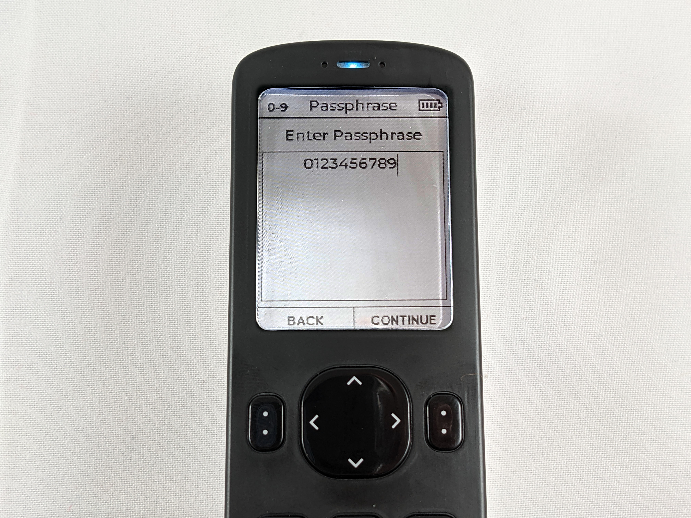
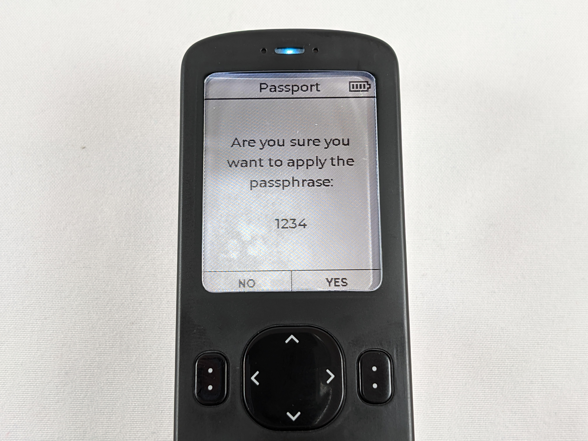
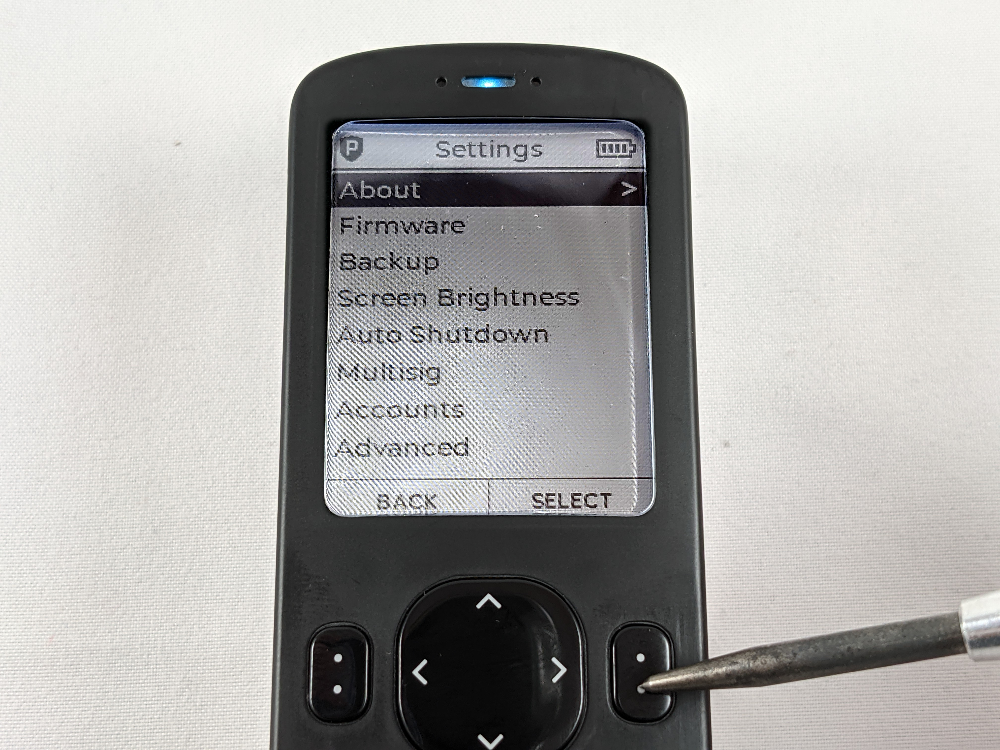
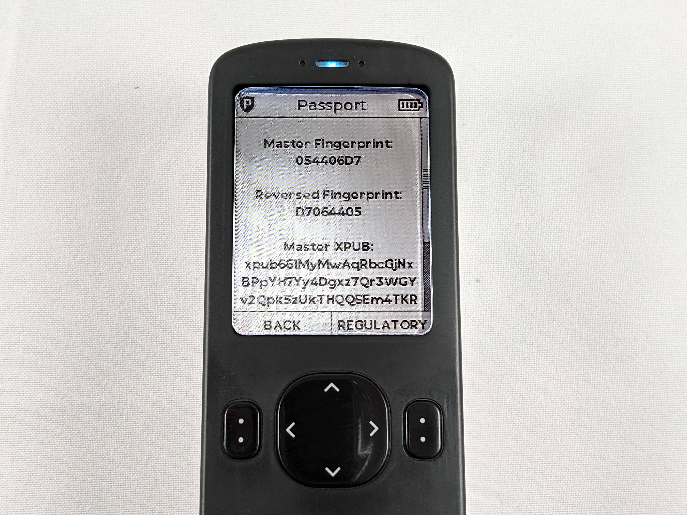

# Creating a Passphrase
A passphrase adds an extra layer of security to your Bitcoin wallet. The passphrase is an additional piece of information that is required in order to access your private key and sign transactions. The passphrase can be thought of as a "25th word" appended to the end of your 24-word seed phrase. Without the passphrase, the bitcoin will not be accessible.

There are some important considerations to make with passphrases:

- With the added security comes added complication. Keep in mind that it may not be you attempting to recover your bitcoin, it may be your loved ones who may not understand how Bitcoin wallets work. 
- The Passport (or any BIP39 wallet) has no way of knowing whether or not you entered the correct passphrase. Any passphrase entered will cause the wallet to display a fully functioning and valid bitcoin wallet. But only when you enter your passphrase correctly will the right wallet be opened. A "fingerprint" is used to uniquely identify the wallet so you know it is the right one.
- You will now need to secure an extra piece of information for a complete backup. This can a disadvantage if you want to minimize the information required to access your bitcoin or this could be advantageous if you leverage it as a duress feature. 

If you want to add a passphrase to your Passport, this section will show you how to do it. Make sure you write this information down in a notebook and secure it. The passphrase is not stored in your Passport encrypted backup file. 

After you add a passphrase, in order to have a complete backup, you will need:

- The microSD card with the encrypted backup file
- The 6-word password to decrypt it
- The passphrase & fingerprint  

### Step 1
Login to the Passport and then from the main menu select `Settings` > `Advanced` > `Passphrase` > `Set Passphrase`. 

  
  
  
  

  
This brings you to the screen where you can enter your passphrase. Passphrases are not limited to words like the seed phrase. Passphrases can contain any combination of special characters, lower case letters, upper case letters, or numbers.      
  

  
  
  
  

You can make your passphrase an easy to remember phrase or even a random high-entropy string of characters. 

  
  

Once you decide what you want your passphrase to be, make sure you write it down exactly as you have it entered in the Passport. Remember, any deviation from this passphrase going forward will result in a completely different wallet being generated and you will lose your bitcoin if you do not save this information correctly and test it prior to making deposits. The Passport has no way of knowing if you entered the correct passphrase or not and there is nothing that can be done to help you recover a lost or forgotten passphrase.

The Passport will display the passphrase you are about to apply, if everything looks correct, click on <kbd>YES</kbd> to apply the passphrase. 

  

  

Once a passphrase is applied, you will notice the "P" shield in the upper left-hand corner signifying that a passphrase has been applied and that you are operating in a different wallet than the one you initially logged into. Also, if you want to be prompted for your passphrase upon logging into your Passport in the future then you can enable this setting by navigating to and selecting `Enter at Startup` >  `Enabled`.

  
  

Next, you want to ensure that you write down the fingerprint as well along with your passphrase. The finger print is a unique string of characters that helps you identify that you have entered your passphrase correctly and that you are operating in the correct wallet when using the Passport in the future. 

You can find your wallet's fingerprint be navigating back to the `Settings` menu and then `About`. Note the `Master Fingerprint`.

  
  

Now that you have a seed phrase and passphrase created and your backup information secured, it is important to verify that your backup information is sufficient for recreating this exact wallet.  
