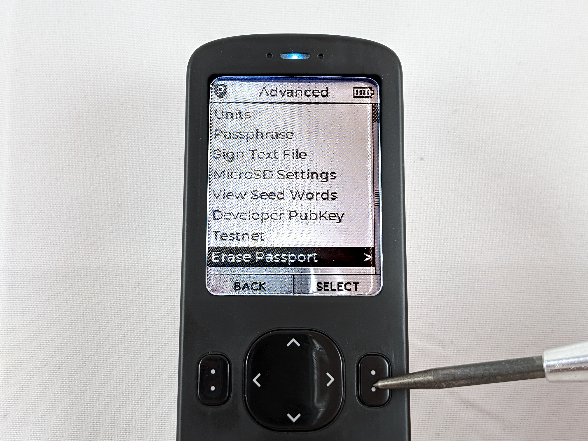

# Testing Backups
This section will cover how to test your backups and ensure that you have all the information necessary to recover your wallet in the event that you no longer have access to your Passport. Verifying the viability of your backup is an important step to take prior to depositing any bitcoin to your wallet. This may seem counter intuitive after taking all that time to setup your new Passport but in this section you will see how to delete your private keys from your Passport. Then you will use your backup information to recreate your wallet. 

This exercise not only ensures that your backup works but it also helps you understand the steps necessary to recover your wallet. You don't want to wait until you absolutely need to recover your funds to learn how this works. Doing some practice and understanding the steps now, before making bitcoin deposits, will help you remain calm and know all the steps when it really counts. 

## From microSD Card
First, ensure you have your encrypted file password written down. This is the 6-word password that your Passport generated for you when you setup the device. Login to the Passport and enter your passphrase, if you enabled the setting to prompt you for it at login. Then navigate to `Settings` > `Backup` > `View Password`. This will display your 6-words and you can confirm you have this information notated correctly. 

  
  
  
  

Second, navigate back to `Settings` then go to `Advanced` & `Erase Passport`. Then select <kbd>YES</kbd> to confirm that you wish to erase your Passport. 

  
  
  

  
  
Then read the message that explains that by confirming, you understand all funds will be lost without a proper backup. Scroll to the bottom of that message and then press <kbd>confirm</kbd> to acknowledge you understand the risks. This will initiate the Passport to erase your seed phrase.  
  

  
  
  

Once the Passport reboots itself, insert your microSD card with the encrypted backup file. Log back in and then from the main menu select `Restore Backup` then press <kbd>CONTINUE</kbd> to select the encrypted backup backup file from the microSD card. You probably only have one file to choose from, so select that file.   

  
  
  
  

Next, you will be asked for your encrypted file password. Using the alphanumeric key pad, press the keys that spell the word you want. For example, to enter the word `ruin`, press `7`, `8`, `4` for `r`, `u`, `i` and then select `ruin` from the short list of possible words. 

 

Repeat that process for all 6-words in order, making up your password. Then The Passport will alert you that the restoration was sucessful and that the device will now reboot. You can remove the microSD card at this time.  

 

Next, you want to apply your passphrase and ensure you get the same fingerprint returned that you have notated. Navigate to `Advanced` > `Passphrase` > `Set Passphrase` then enter and apply your passphrase. 

 
 
 
  

With the passphrase applied, you can then navigate to `Settings` > `About` and view the Master Fingerprint there. This should match your records, if it does not match your records then you either entered the passphrase incorrectly or you have the wrong passphrase written down. 

 
 

Now you know that your encrypted backup file on your microSD card works to restore your wallet and that your passphrase works too.

## From Written Seed Words
This part demonstrates how to ensure the written seed phrase and passphrase can be used to restore your wallet. If you are only using the encrypted backup file on the microSD card then this step is not necessary for you. This is meant for people who want to write down their seed phrase or stamp it into metal. 

First, ensure you have written down your seed phrase words correctly and in the right order. To verify this, login to your Passport, then from the main menu select `Settings` > `Advanced` > `View Seed Words`. 

 
 
 

You will be presented with a message explaining that anyone with access to these words has access to your bitcoin. Press the down arrow to scroll to the bootom of the message then press <kbd>YES</kbd>. 

 
 

Then you can scroll through the list of words on your Passport and compare it to the list of words you have written down. Checking to be sure that the words are written down correctly and that they are in the right order. 

