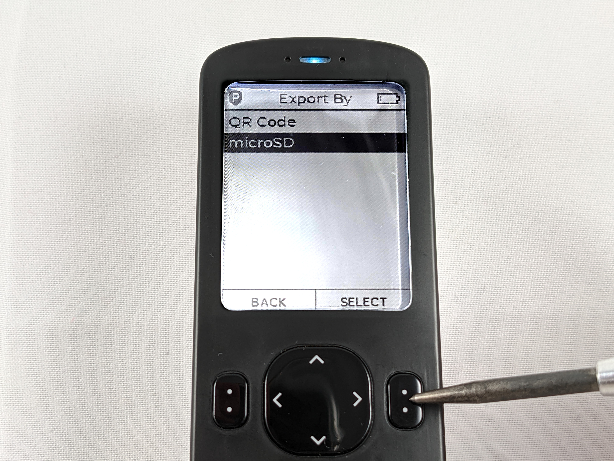
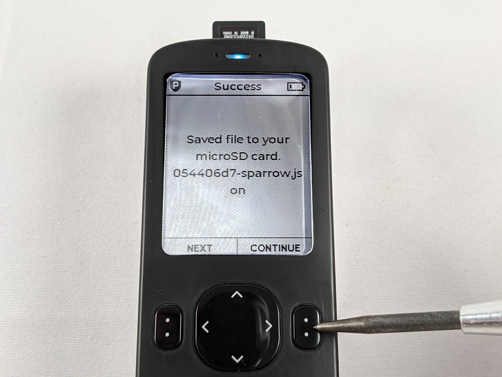
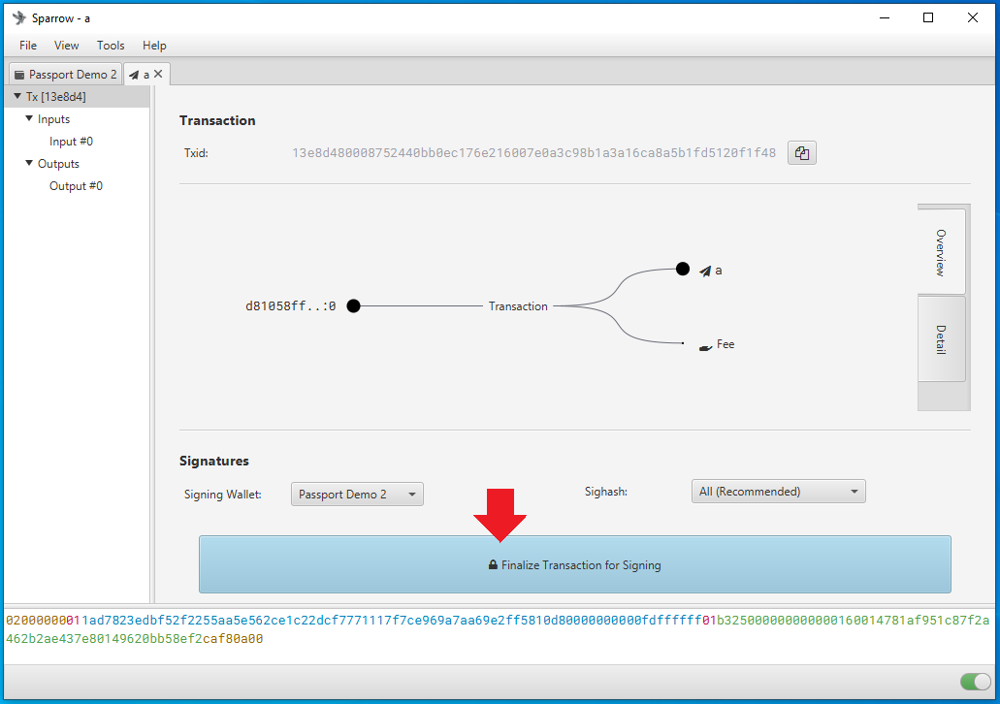

# Connecting Passport with Sparrow Wallet
In this section you will see how to import information to Sparrow Wallet that allows you to monitor your Passport bitcoin balance, generate receive addresses, and create transactions all while keeping the Passport air-gapped. Sparrow Wallet is a desktop Bitcoin wallet designed to be connected with your own node. This is a user-friendly wallet with an intuitive interface and many capabilities and advanced features. To learn more about Sparrow Wallet and for installation instructions, visit the [Sparrow Wallet website](https://www.sparrowwallet.com/).

This section demonstrates how to connect Passport with Sparrow Wallet using your own BitcoinCore node. If you don't have your own Bitcoin node, you can use reputable public Electrum servers. However, there are privacy tradeoffs that come with using the convenience of a public Electrum server. Luckily there are a number of resources available to help you spin up your own Bitcoin node, to learn more check out:

- [BitcoinCore.org](https://bitcoincore.org/en/about/)
- [Ministry of Nodes](https://www.ministryofnodes.com.au/) 
- [Sparrow Wallet Documentation](https://www.sparrowwallet.com/docs/connect-node.html)  

Once you have your BitcoinCore node ready, there are a couple steps needed to configure it to work with Sparrow Wallet. 

If you have BitcoinCore running on the same computer as Sparrow Wallet, then all you need to do is open the `bitcoin.conf` configuration file and add `server=1` near the top and save it. Then relaunch BitcoinCore. You may have a blank configuration file if this was a new BitcoinCore install and that is fine.  

Alternatively, if you are running BitcoinCore on a remote computer, you need to add a username & password and the Remote Procedure Calls (RPC) binding local IP addresses in the configuration file. To do this, navigate to the `bitcoin.conf` configuration file and open it in your preferred text editor. Then add the local IP address for your node and the local IP address for your desktop. For example:

`rpcuser=pi`

`rpcpassword=Nakamoto21`

`rpcbind=127.0.0.1`

`rpcbind=192.168.0.11 #(your node)`

`rpcallowip=127.0.0.1`

`rpcallowip=192.168.0.12 #(desktop)`

  

Save those changes and then you should be able to connect to your BitcoinCore node from your computer on the same local network. Make sure you restart BitcoinCore after saving those changes. 

Now you are ready to configure Sparrow Wallet to talk to your BitcoinCore node. Once you have Sparrow Wallet installed and launched, you will be presented with an empty user interface. Navigate to `File` > `Preferences`:

  

Then click on the <kbd>Server</kbd> tab on the left-hand side. Click on the <kbd>Bitcoin Core</kbd> tab for the `Server Type`. If running BitcoinCore on the same computer, use the `127.0.0.1` rpcbind IP address with `8332` as the port and the default authentication option. Or if running BitcoinCore on a different computer, use the same User/Pass that you entered in the `bitcoin.conf` file. Either way, set the Data Folder directory to the same folder the `bitcoin.conf` file is being written (you should have been promted to specify this folder when you launched BitcoinCore for the first time prior to Initial Block Download). This should be the same directory that BitcoinCore writes the `.cookie` file that Sparrow Wallet needs to read. Test the network connection from Sparrow Wallet. If it’s good, you should see the green check mark next to <kbd>Test Connection</kbd> and some information populated in the dialog box below that. Then you can close that window.   

  

Unfortunately, BitcoinCore stores your public keys and balances unencrypted on the computer it is running on. Although your bitcoin are not directly at risk of theft, if this computer is regularly connected to the internet, it is at risk to hackers - which has the potential to make you a target if your balance and geographic location are discovered. To learn more about Sparrow Wallet best practices, check out [this Sparrow Wallet resource](https://www.sparrowwallet.com/docs/best-practices.html). 

Now that Sparrow Wallet is connected with BitcoinCore, the Passport can be connected via QR code if you have a webcam on your computer.  

Since the Passport is strictly an air-gapped hadware wallet, a Partially Signed Bitcoin Transaction (PSBT) is utilized to spend bitcoin from the Passport. The information necessary to generate such transactions is imported to Sparrow with the QR codes from the Passport. Basically, the public information from the Passport called an XPUB will be used to import the necessary information into Sparrow Wallet on your desktop. By doing this, Sparrow Wallet will be able to generate receive addresses and QR codes, monitor the Passport's balance, and initiate PSBT's. All without exposing any of the private information from the Passport, like the signing key. 

You can also use the microSD card to transfer information between the desktop and the Passport but the QR codes enable a faster user experience. This section will cover both, starting with the QR code method. 

## Importing via QR Code
To import a single signature wallet via QR code, first login to your Passport and enter your passphrase if you are using one. Then from the main menu navigate to `Pair Wallet` > `Sparrow` > `Single-sig` > `QR Code`. Once you press <kbd>CONTINUE</kbd> the Passport will start flashing a series of QR codes, so hold off pressing that for a moment while you prepare Sparrow Wallet on your desktop. 

  
  
  
  
  
  

  
In Sparrow Wallet on your desktop, navigate to `File` > `Import Wallet`.

From the menu of wallets that pop up, scroll down to `Passport` and select <kbd>Scan...</kbd>

This should launch your webcam, now you can pick your Passport back up and press <kbd>CONTINUE</kbd> to initiate the series of QR codes. If you want to resize the QR codes on the passport screen, you can press the <kbd>Resize</kbd> button to change the QR code resolution to three possible sizes. 

  

Capturing the whole series of QR codes can take a moment so try to keep the passport steady and the QR codes within the dotted boundary lines on the Sparrow Wallet screen. You can skip ahead to the "After the Import" section. 

## Importing via File
To import a single signature wallet via file, first login to your Passport and enter your passphrase if you are using one. Then from the main menu navigate to `Pair Wallet` > `Sparrow` > `Single-sig` > `microSD`. 

  
  
  
  
  

  
Make sure you insert the microSD card. The Passport explains that it is about to save a `.json` file to your microSD card with the XPUB information. This information will not put your funds at risk however, they may put your privacy at risk as this XPUB information can be used to recreate your balance and transaction history. The Passport will let you know what the file name is going to be. 

  
  

Next the Passport will ask you to verify that import was sucessful by scanning an address generated from Sparrow Wallet and then scanning that address with the Passport camera to ensure it is an address that the Passport created. Set the Passport aside for now and go through the next section to get Sparrow Wallet ready to do this.  

Remove the microSD card from the Passport and insert it into a microSD to USB adaptor and insert that to your desktop computer running Sparrow Wallet. 

In Sparrow Wallet on your desktop, navigate to `File` > `Import Wallet`.

From the menu of wallets that pop up, scroll down to `Passport` and select <kbd>Import File...</kbd>

This should launch your file explorer where you can navigate to the file location of the exported `.json` file on the microSD card and select <kbd>Open</kbd>.

## After either QR code or File Import
Once the necessary information has been gathered by Sparrow Wallet, either by QR code import or by `.json` file import, you should be taken back to the previous menu screen in Sparrow Wallet. This time though, you should notice that you can choose the `Script Type` from a drop down menu, this is where you can choose whether you want to use legacy Bitcoin addresses that start with "1", or Nested SegWit addresses that start with "3", or Native SegWit addresses that start with "bc1q", or Taproot addresses that start with "bc1p". In this demo, Native SegWit, "bc1q" addresses are used. 

  
Next, Sparrow Wallet will ask you to name your new wallet. This can be whatever you choose. In this example, "Passport Demo" is used. Then click on <kbd>Create Wallet</kbd>.

  
Then Sparrow Wallet will ask you if you want to use a password on this wallet. This password is what encrypts your wallet data file on your desktop and it is optional. If anyone gains access to your desktop, they could potentially open your wallet data file if it is not password protected. In this case, even if someone does open your wallet data file, they would not be able to spend your bitcoin becuase a signature from the Passport would be required to do that.  
  
  

After applying the changes, you can now navigate through your watch-only wallet in Sparrow Wallet. 

On the left-hand side of the Sparrow Wallet interface there are six tabs. The <kbd>Transactions</kbd> tab is where you can see information related to the transactions in this watch-only wallet. The <kbd>Send</kbd> tab is where you can create the PSBTs to then sign with Passport via QR code or microSD card. The <kbd>Receive</kbd> tab is where you can generate receive address for your Passport without having to retreive the Passport and log into it. The <kbd>Addresses</kbd> tab shows several deposit and change addresses as well as any balances. The <kbd>UTXOs</kbd> tab shows any unspent transaction outputs and a small graph charting the history. Finally, the <kbd>Settings</kbd> tab is where you can see detailed information about the watch-only wallet such as the master fingerprint, derivation path, & xpub.  

If you imported your Passport wallet from file, you still need to scan an address to verify with your Passport. Navigate to the `Receive` tab in Sparrow Wallet, this will bring up a Bitcoin receive address along with the QR code. Now you can scan this QR code with your Passport to verify the wallet import was completed successfully.  

  
  
 
 

Scan this QR code with your Passport and you should see a promt on the Passport saying "Pairing Complete". 

Back in Sparrow Wallet you can click on the <kbd>Receive</kbd> tab on the left-hand side menu any time you want to generate a new receive address. You can scan this QR code with your mobile Bitcoin wallet, for example, and deposit some bitcoin to your Passport. You should see the transaction show up in Sparrow Wallet after a moment along with a pop-up notification. Also, in BitcoinCore, the transactions should show up there as well. The transaction will remain in a pending status until it receives some blockchain confirmations. In the mean-time, you can click on the <kbd>Transactions</kbd> tab and review further details about your transaction. You can also copy/paste your transaction ID in [mempool.space](https://mempool.space/) to watch for your first confirmation, or use whatever your preferred block explorer is. [Tor Browser](https://www.torproject.org/download/) is a privacy-focused browser.  

  
  
  
  
  

Now you can power off and secure your Passport in a safe place until you want to sign a transaction and spend from it, several addresses will be cataloged in Sparrow Wallet so you can continue depositing to your Passport via Sparrow Wallet without having to reconnect it every time. It is best practice to confirm each receiving address on the Passport itself and additionally to only use each address once. 

When you are ready to sign a transaction to spend bitcoin, it is necessary to create a PSBT. You can deposit bitcoin with your Passport disconnected but to spend bitcoin, the Passport needs to sign the transaction. Sparrow Wallet is used to build the transaction based on your available Unspent Transaction Outputs (UTXOs) and the information you enter when constructing the transaction. The PSBT details are passed between Sparrow Wallet and the Passport using the QR code exchange method or the microSD card. 

## Signing a PSBT via QR Code
To create a PSBT, navigate to the <kbd>Send</kbd> tab on the left-hand side in Sparrow Wallet. There, you can paste the address you are sending to, add a label, enter an amount to send, and choose a miners fee rate, etc. Once you have everything set, click on <kbd>Create Transaction</kbd>. On the next screen, double check the details then click on <kbd>Finalize Transaction for signing</kbd>. Then you will be asked what you want to do with the finalized PSBT. In this case, click on <kbd>Show QR</kbd> and Sparrow Wallet will launch an animated series of QR codes.  

  
  
  
  
  

  
With your Passport, ensure you have the passphrase applied, then from the main menu select `Scan with QR Code`. Then point the camera on the Passport to the flashing series of QR codes in the Sparrow Wallet interface. 

On the Passport screen you will be shown the amount of bitcoin being spent & the address it is being spent to, press <kbd>CONTINUE</kbd> if the details are correct. The Passport will then tell you what the change amount is, if any, press <kbd>CONTINUE</kbd>. Lastly, the Passport will display the network fee, if everything is correct then press <kbd>SIGN</kbd>. 

  
  
  

Once the transaction is signed by the Passport, a QR code will be displayed on the Passport screen. Back on your desktop, in Sparrow Wallet, select the `Scan QR` button with the camera icon.  

This will launch your desktop webcam and you can hold the Passport infront of your webcam so that Sparrow Wallet can read the details of the signed transaction.

Once Sparrow Wallet picks up the details of the signed transaction, then you can broadcast the transaction to the Bitcoin network by pressing the <kbd>Broadcast Transaction</kbd> button.  

## Signing a PSBT via microSD
To create a PSBT, navigate to the <kbd>Send</kbd> tab on the left-hand side in Sparrow Wallet. There, you can paste the address you are sending to, add a label, enter an amount to send, and choose a miners fee rate, etc. Once you have everything set, click on <kbd>Create Transaction</kbd>. On the next screen, double check the details then click on <kbd>Finalize Transaction for signing</kbd>. Then you will be asked what you want to do with the finalized PSBT. In this case, click on <kbd>Save Transaction</kbd> and Sparrow Wallet will launch your file explorer. Navigate to your microSD card and save the the finalized transaction there. 

  
   
  
  

  

Take the microSD card, insert it into the Passport. Power on the Passport and login to it and apply the passphrase if necessary. Navigate to `Sign with microSD` then the Passport will display the amount to be spent and the destination address. Press <kbd>CONTINUE</kbd>.  

  
   

 

The passport will display the change, amount of any, press <kbd>CONTINUE</kbd>. Next, the network fee will be displayed, if everything looks correct, press <kbd>SIGN</kbd>. Then the Passport will save the signed `.psbt` to the microSD card. You can remove the microSD card and press <kbd>CONTINUE</kbd> then shut down your Passport.     

  
   
  

 

Insert the microSD card into your USB adaptor and insert that into the computer. Then back in Sparrow Wallet, click on `Load Transaction` from the same screen you originally saved the `.psbt` file. Navigate to the microSC card and select the signed `.psbt` file. 

Once the transaction is loaded, click on the <kbd>Broadcast Transaction</kbd> button in Sparrow Wallet to send the transaction to the Bitcoin network. 

At the time of broadcast you should see the transaction in BitcoinCore as well as receive a notification in Sparrow Wallet. Again, you can copy the transaction ID and paste in your preferred block explorer to watch for confirmations.
                                                          

The main point here is that your Passport is the required signing device while your Sparrow Wallet is your interface, transaction builder, & broadcaster. In this configuration, Sparrow Wallet can do many things like catalog addresses and build transactions but without the signature from your Passport, Sparrow Wallet cannot authorize spending of any bitcoin. 

You should now be able to connect your Passport with Sparrow Wallet and sign transactions via QR code or microSD card. 
